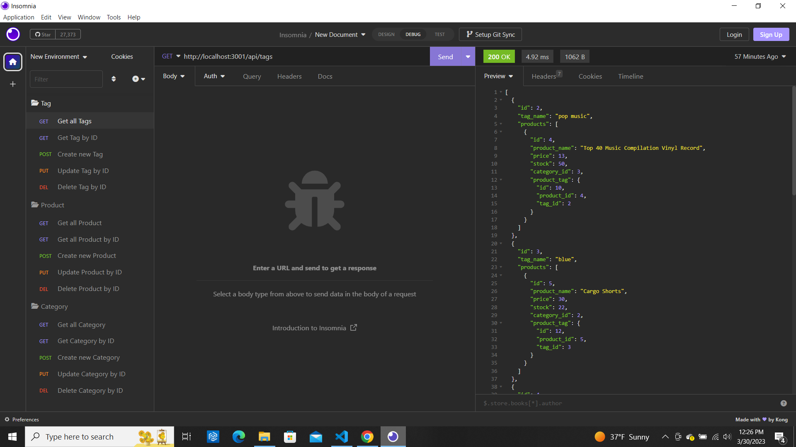

# e-commerce backend

## Description
Allows users to view, create, edit, and delete products, categories and tags for an e-commerce site.  

## Table of Contents
- [e-commerce backend](#e-commerce-backend)
  - [Description](#description)
  - [Table of Contents](#table-of-contents)
  - [Installation](#installation)
  - [Usage](#usage)
  - [Licence](#licence)
  - [Contributing](#contributing)
  - [Tests](#tests)
  - [Questions](#questions)
  - [Screenshot](#screenshot)
  - [Link to Github repository](#link-to-github-repository)
  - [Link to walkthrough Video](#link-to-walkthrough-video)

## Installation
Download the code from my github repository. You will need to install dotenv 8.2.0, express 4.17.1, mysql2 2.1.0, and sequelize 5.21.7. In the .env folder enter your mysql credentials. At the prompt log into mysql2, type source db/schema.sql to initialize the database. Log out of mysql2. At the promt enter npm run seed to seed the database.
## Usage
At the prompt type npm start to start the server.  Go to Insomnia. There are three routes. They are categories, products, and tags. Use Get, Post, Put, and Delete data from the database. To view one category, product, or tag use /id.
## Licence
This project uses the [MIT](https://opensource.org/license/mit/) license.

## Contributing
If you would like to contribute to this project email me at the address below.
## Tests
None at this time.
## Questions
If you have any questions you can contact me at [michaeloc@verizon.net](michaeloc@verizon.net)  
Visit me at [Github](https://github.com/michaeloc1)
## Screenshot

## Link to Github repository
[Link](https://github.com/michaeloc1/e-commerce) to Github repository.
## Link to walkthrough Video
[Link](https://www.youtube.com/watch?v=g_qA9lt1NdQ) to walkthrough video.

